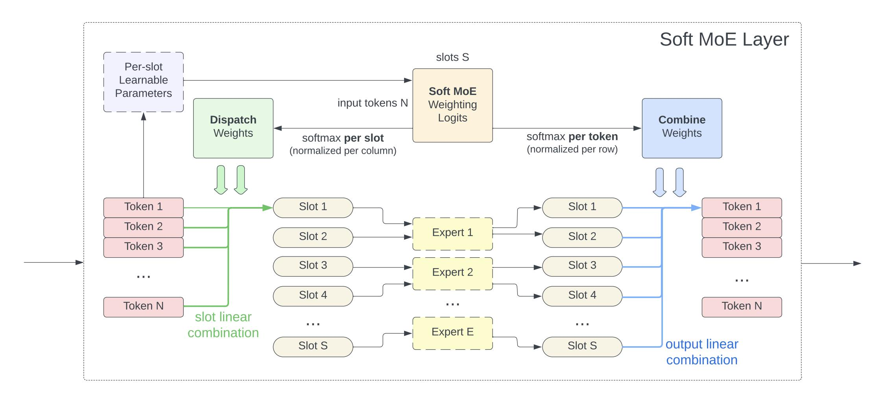

# soft-mixture-of-experts

PyTorch implementation of Soft MoE by Google Brain in [From Sparse to Soft Mixtures of Experts](https://arxiv.org/abs/2308.00951.pdf)



> Thanks to [lucidrains](github.com/lucidrains) for his excellent `x-transformers` library! 🎉
> 
> The ViT implementations here are *heavily* based on his [ViTransformerWrapper](https://github.com/lucidrains/x-transformers/blob/7395ebd9bfaea85ef8358e1d46ca176351058017/x_transformers/x_transformers.py#L1215).

### TODO

- [x] Implement Soft MoE layer ([Usage](#softmoe), [Code](./soft_mixture_of_experts/soft_moe.py))
- [x] Example end-to-end Transformer models
    - [x] vision transformer ([Usage](#vision-transformers), [Code](./soft_mixture_of_experts/vit.py))
    - [ ] ~~language model~~ (skip for now)
    - [x] add to README
- [x] Set up unit tests
    - [x] SoftMoE
    - [x] Transformer layers
    - [x] ViT models
- [x] Reproduce parameter counts from Table 3 ([Ablations](#ablations))
- [x] Reproduce inference benchmarks from Tables 1, 2 ([Ablations](#ablations))
- [x] Release on PyPI
    - [x] Prerelease
    - [x] Stable


## Install

PyPI:
```bash
pip install soft-mixture-of-experts
```

From source:
```bash
pip install "soft-mixture-of-experts @ git+ssh://git@github.com/fkodom/soft-mixture-of-experts.git"
```

For contributors:
```bash
# Clone/fork this repo. Example:
gh repo clone fkodom/soft-mixture-of-experts
cd soft-mixture-of-experts
# Install all dev dependencies (tests etc.) in editable mode
pip install -e .[test]
# Setup pre-commit hooks
pre-commit install
```


## Usage

### Vision Transformers

Using the `ViT` and `SoftMoEViT` classes directly:

```python
from soft_mixture_of_experts.vit import ViT, SoftMoEViT

vit = ViT(num_classes=1000, device="cuda")
moe_vit = SoftMoEViT(num_classes=1000, num_experts=32, device="cuda")

# image shape: (batch_size, channels, height, width)
image = torch.randn(1, 3, 224, 224, device="cuda")

# classification prediction
# output shape: (batch_size, num_classes)
y_vit = vit(image)
y_moe = moe_vit(image)

# feature embeddings
# output shape: (batch_size, num_patches, d_model)
features_vit = vit(image, return_features=True)
features_moe = moe_vit(image, return_features=True)
```

or using pre-configured models:
```python
from soft_mixture_of_experts.vit import soft_moe_vit_small

# Available models:
# - soft_moe_vit_small
# - soft_moe_vit_base
# - soft_moe_vit_large
# - vit_small
# - vit_base
# - vit_large
# - vit_huge

# Roughly 930M parameters 👀
moe_vit = soft_moe_vit_small(num_classes=1000, device="cuda")

# Everything else works the same as above...
```


### Transformer Layers

```python
from soft_mixture_of_experts.transformer import (
    TransformerEncoder,
    TransformerEncoderLayer,
    TransformerDecoder,
    TransformerDecoderLayer,
)

encoder = TransformerEncoder(
    TransformerEncoderLayer(d_model=512, nhead=8),
    num_layers=6,
)
decoder = TransformerDecoder(
    TransformerDecoderLayer(d_model=512, nhead=8),
    num_layers=6,
)

# input shape: (batch_size, seq_len, d_model)
x = torch.randn(2, 128, 512, device="cuda")

mem = encoder(x)
print(mem.shape)
# torch.Size([2, 128, 512])

y = decoder(x, mem)
print(y.shape)
# torch.Size([2, 128, 512])
```


### Soft MoE

```python
import torch

from soft_mixture_of_experts.soft_moe import SoftMoE

# SoftMoE with 32 experts, 2 slots per expert (64 total):
moe = SoftMoE(
    in_features=512,
    out_features=512,
    num_experts=32,
    slots_per_expert=2,
    bias=False,  # optional, default: True
    device="cuda",  # optional, default: None
)

# input shape: (batch_size, seq_len, embed_dim)
x = torch.randn(2, 128, 512, device="cuda")

y = moe(x)
print(y.shape)
# torch.Size([2, 128, 512])
```


## Ablations

I closely reproduce the parameter counts and (relative) inference times from the paper.

### Table 3

All models are benchmarked with:
```python
batch_size = 8  # see note below
image_size = 224
num_channels = 3
num_classes = 21000  # as in ImageNet 21k
```

> $\dagger$ The authors benchmark "eval ms/img" using TPUv3, and I use single A100 40GB.  The authors also are not clear on the batch size used for inference.  In Figure 6, they specifically mention using batch size 8. So, I assume a batch size of 8, and observe that inference times are similar to what is reported in the paper.

| Model | Params | Params <br> (paper) | Eval ms/img $\dagger$ | Eval ms/img <br> (paper) |
| --- | --- | --- | --- | --- |
| ViT S/16 | 30 M | 33 M | 0.9 | 0.5 |
| Soft MoE S/16 128E | 932 M | 933 M | 1.3 | 0.7 |
| Soft MoE S/14 128E | 1.8 B | 1.8 B | 1.5 | 0.9 |
| ViT B/16 | 102 M | 108 M | 1.0 | 0.9 |
| Soft MoE B/16 128E | 3.7 B | 3.7 B | 1.5 | 1.5 |
| ViT L/16 | 325 M | 333 M | 1.8 | 4.9 |
| Soft MoE L/16 128E | 13.1 B | 13.1 B | 3.5 | 4.8 |


## Test

Tests run automatically through GitHub Actions on each `git push`.

You can also run tests manually with `pytest`:
```bash
pytest
```


## Citations

```bibtex
@misc{puigcerver2023sparse,
      title={From Sparse to Soft Mixtures of Experts}, 
      author={Joan Puigcerver and Carlos Riquelme and Basil Mustafa and Neil Houlsby},
      year={2023},
      eprint={2308.00951},
      archivePrefix={arXiv},
      primaryClass={cs.LG}
}
```
